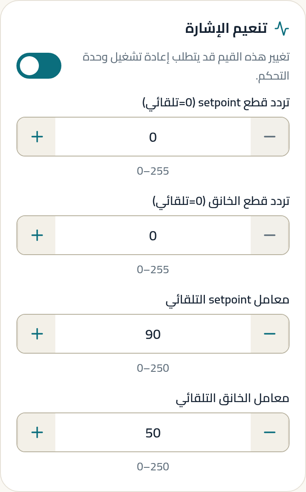
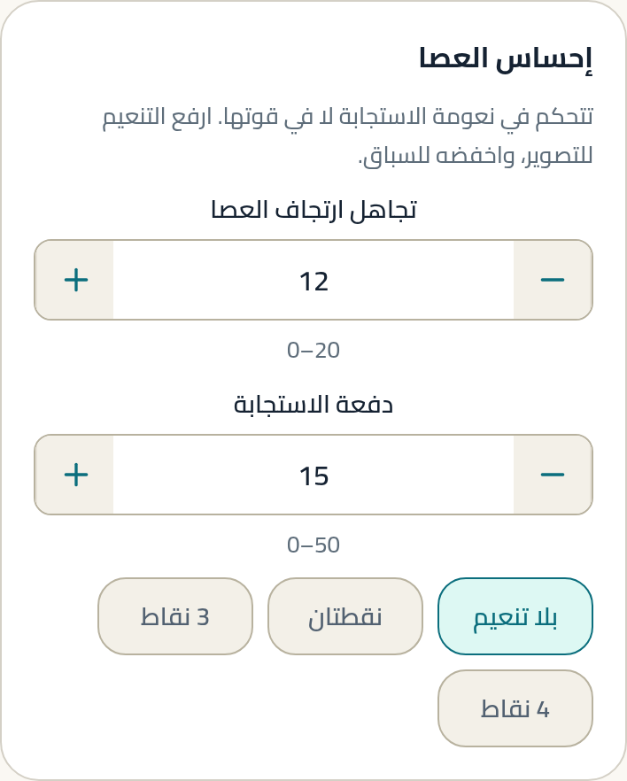
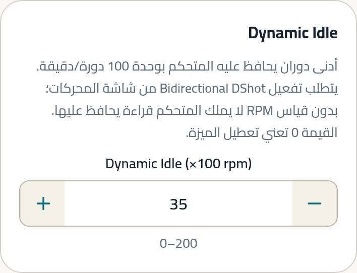
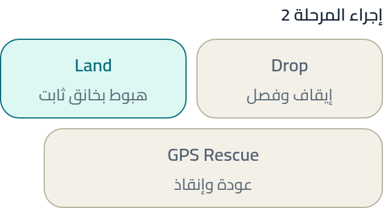
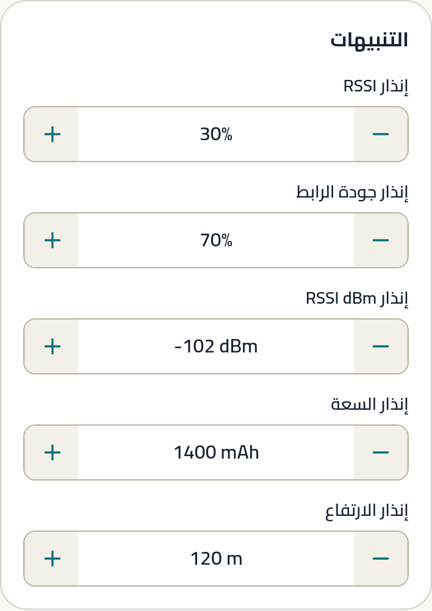

# الطيران السينمائي

طيران هادئ ومتصل، الهدف فيه أن تبدو اللقطة كأن كاميرا محمولة على
ذراع، لا على طائرة.

---

## لمن هذا الدليل

لمن يصوّر: تتبّع، دوران بطيء حول هدف، مرور داخل مساحة ضيقة. الأولوية
للنعومة على الحدّة، ولاستمرار الحركة على سرعتها.

**المنصات المعتادة:** Cinewhoop (مراوح محمية) · Cinelog · 5" بكاميرا
HD · 7" للقطات الواسعة.

---

## الحقيقة أولًا

> **حقيقة (Betaflight).** مكتبة الإعدادات الرسمية تُعرّف «سينمائي»
> بتغيير إعدادَي إحساس عصا اثنين وقيمتَي تنعيم — **ولا تلمس
> P أو I أو D إطلاقًا** (S1.1, S1.2).

> **توصيتنا.** ابدأ من نفس المكان. لا تعدّل PID لتحصل على لقطة أنعم؛
> عدّل إحساس العصا. الـ PID مسؤول عن ثبات الطائرة، لا عن نعومة يدك.

---

## نقطة البداية الموصى بها

هذه **نقطة بداية**، لا ضبط نهائي. المقصود أن تطير أول رحلة بشيء
معقول ثم تعدّل من هناك.

### إلزامي

| اضبط | ابدأ بـ | لماذا | غيّرها إذا |
|---|---|---|---|
| تجاهل ارتجاف العصا | **12** `[A]` (S1.1) | يمنع ارتعاش يدك من الظهور في اللقطة | ترى الحركة متأخرة → اخفضها إلى 8 |
| تنعيم Feedforward | **بلا تنعيم (OFF)** `[A]` (S1.1) | الاختيار الرسمي للسينمائي | — |
| معامل setpoint التلقائي | **90** `[A]` (S1.1) | يذيب درجات إشارة الراديو إلى حركة متصلة | تريد نعومة أقصى → 180 (S1.2) |
| معامل الخانق التلقائي | **50** `[A]` (S1.1) | يمنع قفزات الارتفاع الظاهرة في الصورة | — |
| إجراء Failsafe | **هبوط (LAND)** `[C]` | تصوّر قريبًا وفي أماكن فيها ناس أو أثاث | تطير فوق ماء → القطع أنظف |

### موصى به

| اضبط | ابدأ بـ | لماذا | غيّرها إذا |
|---|---|---|---|
| إنذار RSSI dBm | **−102** `[A]` (S1.1) | تطير قريبًا وبطيئًا، فتحتمل رابطًا أضعف | تبتعد فعلًا → ارفعه نحو −98 |
| Bidirectional DShot | **مفعّل** `[A]` (S1.10b) | شرط فلتر RPM، وهو ما يجعل الفيديو خاليًا من الاهتزاز. الأصل الرسمي `OFF` (S1.12e)، فتفعيله قرار صريح | لا يدعمه ESC |
| عدد أقطاب المحرك | حسب محركك `[C]` | رقم خاطئ = فلتر يعمل على تردد غير موجود | — |
| Dynamic Idle | **35** (×100 rpm) `[A]` (S1.11a — خيار «Dynamic Idle» داخل الحزمة) | يمنع توقف المروحة في الهبوط الحاد | وووب 1S → 120–150 (S1.8) |

### اختياري

| اضبط | ابدأ بـ | لماذا | غيّرها إذا |
|---|---|---|---|
| دفعة الاستجابة (Boost) | **اتركها 15** `[A]` (S1.13) | الأصل الرسمي للروابط هو 15، والإعداد السينمائي لا يغيّره. خفضها إلى 0 يغيّر الضبط بعيدًا عمّا ينتجه الإعداد الرسمي | تريد استجابة أحدّ عمدًا → ارفعها نحو 18 (S1.4) |
| سقف الفلتر الديناميكي | **750 Hz** (Cinelog) `[A]` (S1.11b) | مراوح صغيرة تدور بسرعة عالية | 6–7" → 550 (S1.11c) |
| أدنى الفلتر الديناميكي | **125 Hz** لبناء نظيف `[B]` (S1.11a) | 80 لبناء عالي الاهتزاز، 100 لمتوسط | تسمع طنينًا → اخفضه |

> **قبل أن تبحث عن حقول الفلتر الديناميكي:** لا يسمح التطبيق بتعديلها إلا
> إذا أثبتت القراءة أن الميزة **نشطة بالفعل** على لوحتك، ولا يسمح بتفعيلها
> أو تعطيلها. هذا مقصود: إرسال قيم تفعيل إلى بناء لم تُثبت قراءته دعمه
> تخمين على متحكم طيران. إن لم تظهر الحقول، فالميزة غير نشطة في بنائك.

### تفضيل شخصي

- **Rates.** لا يوجد رقم رسمي «سينمائي». الاتجاه: أقل من الحر بوضوح،
  وexpo أعلى قليلًا لتنعيم المنتصف. `[C]`
- **زاوية الكاميرا.** منخفضة (10–20°) للطيران البطيء. `[C]`
- **حدّ الخانق.** بعض الطيارين يحدّونه ليمنعوا التسارع المفاجئ. `[C]`

---

## الفرق حسب المنصة

| المنصة | ما يتغيّر | المصدر |
|---|---|---|
| Cinewhoop | `pidsum_limit = 1000` · `thrust_linear` حسب تردد ESC · Dynamic Idle 35 | S1.11a |
| Cinelog (250–300 غ) | سقف الفلتر 750 Hz | S1.11b |
| 5" بكاميرا HD | استعمل ضبط الحر مع قيم إحساس العصا السينمائية | S1.10b + S1.1 |
| 7" للقطات واسعة | أدنى الفلتر 40 Hz · `thrust_linear = 10` | S1.10c |

**`thrust_linear` لا يتبع المقاس بل تردد ESC:** 0 عند 16–24k،
و20 عند 48k، و40 عند 96k+ (S1.11a). لا يعرض هذا التطبيق هذا الإعداد
حاليًا — انظر `_meta/gaps.md` § G-2.

---

<!-- STEPS:BEGIN generated by _tools/write-steps.mjs -->

## خطوات الضبط — بالترتيب

اتبعها من الأولى إلى الأخيرة. كل خطوة تُظهر الشاشة نفسها بالقيم
الموصى بها في هذا الدليل، لا بقيم نمط آخر.

### الخطوة 1 — المستقبل

**أين:** المستقبل · بطاقة تنعيم الإشارة

**الموصى به:** `90` · `50`  ·  المصدر: S1.1

### الخطوة 2 — إحساس العصا

**أين:** ضبط PID · بطاقة إحساس العصا

**الموصى به:** `12` · `15` · 1 خيار محدَّد  ·  المصدر: S1.1، S1.13

### الخطوة 3 — المحركات

**أين:** المحركات · إعدادات ESC

**الموصى به:** `14` · 1 خيار محدَّد · 1 مفتاح مفعّل  ·  المصدر: S1.11a، S1.10b

### الخطوة 4 — Dynamic Idle

**أين:** ضبط PID · بطاقة Dynamic Idle

**الموصى به:** `35`  ·  المصدر: S1.11a

### الخطوة 5 — Failsafe

**أين:** Failsafe · إجراء المرحلة 2

**الموصى به:** 1 خيار محدَّد

### الخطوة 6 — OSD

**أين:** OSD · بطاقة التنبيهات

**الموصى به:** `-102 dBm`  ·  المصدر: S1.1

> كل صورة أعلاه مأخوذة من بناء التطبيق الحالي، ومفحوصة آليًا على
> **حالة عنصر التحكم نفسه** — القيمة داخل الحقل، والخيار المحدَّد،
> والمفتاح المفعّل — لا على مجرد ظهور النص في الصورة.

<!-- STEPS:END -->

---

## تحذيرات

> **التنعيم العالي يعني تأخيرًا حقيقيًا في استجابة العصا.** الإعدادات
> الرسمية نفسها تحمل هذا التحذير حرفيًا (S1.6, S1.7). إن كنت ستطير
> بين عوائق ضيقة، ابدأ من 90 لا من 180.

> **لا تختبر إعدادًا جديدًا وأنت تصوّر لقطة قريبة من ناس أو أشياء.**
> جرّبه في مساحة مفتوحة أولًا.

> **Failsafe يُضبط قبل أول رحلة، لا بعدها.**

---

## ما لا يستطيع التطبيق ضبطه لهذا النمط

| الإعداد | الحالة |
|---|---|
| `thrust_linear` | `NOT SUPPORTED` — اختياري، لا يمنع النمط |
| معاملات فلتر RPM التفصيلية | `NOT SUPPORTED` — الشرطان الأساسيان (DShot ثنائي الاتجاه والأقطاب) مدعومان |
| `pidsum_limit` · `pidsum_limit_yaw` | `NOT SUPPORTED` — يذكرهما إعداد Cinewhoop الرسمي، ويُضبطان من سطر الأوامر |
| منزلقات `simplified_*` | مستبعدة بقرار تصميمي |

التفاصيل: `_meta/gaps.md`.

---

## المصادر

كل رقم عليه `[A]` أو `[B]` مصدره في `_meta/sources.md`.
الأرقام الأساسية من S1.1 و S1.2 (Generic 150Hz Cinematic / Ultra
Cinematic، حالة `OFFICIAL`، المؤلف Ivan Efimov) و S1.11a–b
(UAV Tech Cinewhoop / Cinelog، حالة `OFFICIAL`).

**حالة التحقق:** `SOFTWARE / REFERENCE VERIFIED`.
لم تُختبر أي من هذه القيم في رحلة ضمن هذا العمل.
