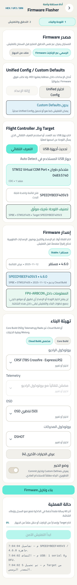
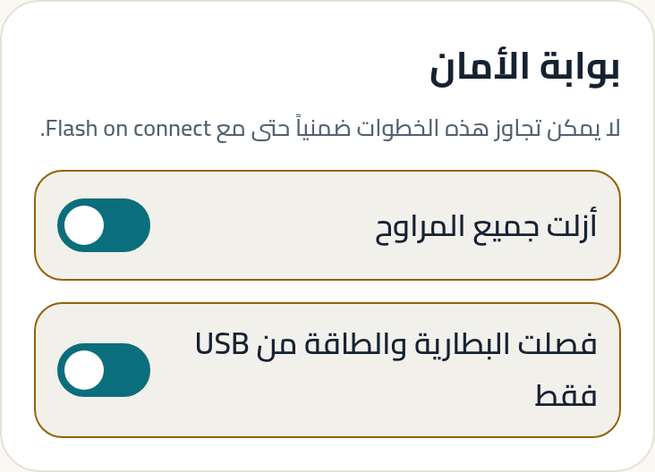

# البرنامج الثابت — قبل أي نمط طيران

**هذه ليست بطاقة نمط طيران.** هذه البطاقة تصف ما يجب أن يكون صحيحًا
في متحكم طيرانك قبل أن يعني أي دليل آخر شيئًا.

---

## لماذا هذه البطاقة أولًا

نمط الطيران هو مجموعة قيم. البرنامج الثابت هو ما يقرر **أي القيم
موجودة أصلًا**. بناء بلا GPS لا يحتوي GPS Rescue، مهما ضبطت. بناء
بلا OSD لا يحتوي إنذار RSSI.

**خيارات البناء أهم من رقم الإصدار.** لوحتان بنفس رقم الإصدار قد
تختلفان تمامًا لأن إحداهما بُنيت بدون ميزة تحتاجها.

---

## الأرضية التي يفترضها هذا التطبيق

| المطلوب | القيمة |
|---|---|
| نوع البرنامج الثابت | Betaflight |
| أدنى إصدار MSP API | 1.47 (Betaflight 4.6 وما بعده) |
| المُتحقَّق منه | 1.47 · 1.48 · 1.49 |

تحت 1.47 لن تفتح شاشات الإعدادات. هذا مقصود: أرضية معروفة أفضل من
كتابة قيم على عقد غير محقَّق.

---

## قبل التحديث

| اضبط | ابدأ بـ | لماذا | غيّرها إذا |
|---|---|---|---|
| نسخة احتياطية | فعّل خيار النسخ الاحتياطي قبل التحديث | التحديث يمسح إعداداتك كلها | لا تعطّلها. لا سبب وجيه. |
| خيارات البناء | اختر ما تحتاجه فعلًا: GPS · OSD · بروتوكول المستقبل | ما لا تختاره لن يوجد بعد التحديث | تحتاج ميزة لم تظهر لاحقًا |
| المراوح | **مفكوكة** | لوحة تُحدَّث قد تُسلّح بشكل غير متوقع | أبدًا |

---

## بعد التحديث — الترتيب الصحيح

1. **المنافذ** — عيّن UART المستقبل و GPS و VTX. بلا هذا لا شيء يعمل.
2. **المستقبل** — بروتوكول المستقبل، وتحقق من حركة القنوات حيًّا.
3. **المحركات** — بروتوكول المحرك، وعدد الأقطاب، واتجاه الدوران.
4. **الأوضاع** — مفتاح التسليح أولًا.
5. **Failsafe** — قبل أول رحلة، لا بعدها.
6. **ثم** دليل نمط طيرانك.

---

## الحزم الجاهزة داخل التطبيق

شاشة «الحزم الجاهزة» تقرأ **مكتبة Betaflight الرسمية نفسها** التي
اشتُقّت منها أرقام هذا الدليل.

**كيف تعمل، وهو مهم:**

1. تتحقق من بصمة الملف قبل عرضه.
2. تحفظ نسخة `diff all` من إعداداتك الحالية.
3. تطبّق الأوامر **بلا حفظ** — أي أن انقطاع الطاقة يعيدك إلى ما كنت عليه.
4. تراجع النتيجة، ثم تحفظ أو تخرج دون حفظ.

**الحالة تظهر بجانب كل حزمة:** `OFFICIAL` أو `COMMUNITY` أو
`EXPERIMENTAL`. الأرقام في هذا الدليل كلها من حزم `OFFICIAL` فقط.

---

<!-- STEPS:BEGIN generated by _tools/write-steps.mjs -->

## خطوات الضبط — بالترتيب

اتبعها من الأولى إلى الأخيرة. كل خطوة تُظهر الشاشة نفسها بالقيم
الموصى بها في هذا الدليل، لا بقيم نمط آخر.

### الخطوة 1 — اللوحة والإصدار وخيارات البناء

**أين:** تحديث البرنامج الثابت · المرحلة 1: اللوحة والبناء

الشاشة مرحلتان: **1 اللوحة والبناء**، ثم **2 التحقق والتفليش**. لا تنتقل إلى الثانية قبل أن تختار لوحة وإصدارًا.

في اللقطة اللوحة مختارة (`SPEEDYBEEF405V3`) والإصدار مختار (`4.6.0`)، ولهذا ظهرت **تهيئة البناء**: بروتوكول الراديو و Telemetry و OSD والمحركات. **هذه هي الخطوة التي تقرر ما سيوجد في لوحتك بعد التحديث** — ما لا تختاره هنا لن يكون موجودًا مهما بحثت عنه لاحقًا في الإعدادات.

### الخطوة 2 — بوابة الأمان قبل التفليش

**أين:** تحديث البرنامج الثابت · المرحلة 2 · بطاقة بوابة الأمان

**الموصى به:** 2 مفتاح مفعّل

المفتاحان في هذه البطاقة ليسا تذكيرًا — التفليش لا يبدأ قبل تفعيلهما، ولا تُتجاوَز البطاقة ضمنيًا حتى مع «Flash on connect». فعّلهما بعد أن تفعل ما يقولانه، لا قبله.

### الخطوة 3 — الحزم الجاهزة

**أين:** الحزم الجاهزة · المكتبة الرسمية

لاحظ **الحزم المتوافقة (5)** — العدد ليس كل ما في المكتبة، بل ما يوافق إصدار **لوحتك أنت**، والإصدار مقروء من المتحكم لا مكتوب يدويًا. وسم «رسمية» بجانب كل حزمة هو حالة `OFFICIAL`.

> كل صورة أعلاه مأخوذة من بناء التطبيق الحالي، ومفحوصة آليًا على
> **حالة عنصر التحكم نفسه** — القيمة داخل الحقل، والخيار المحدَّد،
> والمفتاح المفعّل — لا على مجرد ظهور النص في الصورة.

---

## بقية الإعدادات — قرار لكل واحد

كل ما لا تغيّره الخطوات أعلاه له قرار مكتوب هنا، حتى لا تبقى
تتساءل هل نسيناه. القرارات تخص **هذا النمط وحده**.

| الإعداد | القرار | التفاصيل | المصدر |
|---|---|---|---|
| إعدادات الطيران | **لا ينطبق** | هذه ليست بطاقة نمط طيران. بعد التحديث، افتح ركن نمطك واتبعه من خطوته الأولى. | — |
| النسخة الاحتياطية قبل التحديث | **إجراء — بلا صورة** | فعّل خيار النسخ الاحتياطي قبل بدء التفليش. التحديث يمسح كل إعداداتك، بما فيها Failsafe و GPS Rescue والمعايرة. | — |
| ترتيب ما بعد التحديث | **إجراء — بلا صورة** | المنافذ ← المستقبل ← المحركات ← الأوضاع (مفتاح ARM أولًا) ← Failsafe ← ثم دليل نمطك. | — |

<!-- STEPS:END -->

---

## تحذيرات

> **التحديث يمسح كل إعداداتك.** بما فيها Failsafe و GPS Rescue
> ومعايرة البطارية وربط المفاتيح. النسخة الاحتياطية ليست احتياطًا
> زائدًا — هي الفرق بين إعادة ضبط ودقيقتين.

> **لا تحدّث بمراوح مركّبة.** أبدًا.

> **انقطاع الاتصال أثناء الكتابة قد يترك اللوحة بلا برنامج ثابت
> صالح.** استعمل كابلًا تثق به، ولا تحرّك الجهاز أثناء الكتابة.

> **بعد التحديث، إعدادات Failsafe عادت إلى أصلها.** أعد ضبطها قبل
> أول رحلة.

---

## المصادر

- أرضية API 1.47 وفروق 1.48/1.49: `_meta/compatibility.md`
- حالة الحزم (`OFFICIAL`) ومكتبة الإعدادات: `_meta/sources.md` § S1

**حالة التحقق:** `SOFTWARE VERIFIED` — الشاشات والمسارات مثبتة
باختبارات. مسار التحديث نفسه على عتاد حقيقي مذكور في
`docs/HARDWARE_RELEASE_CHECKLIST.md` ولم يُنفَّذ بعد.
