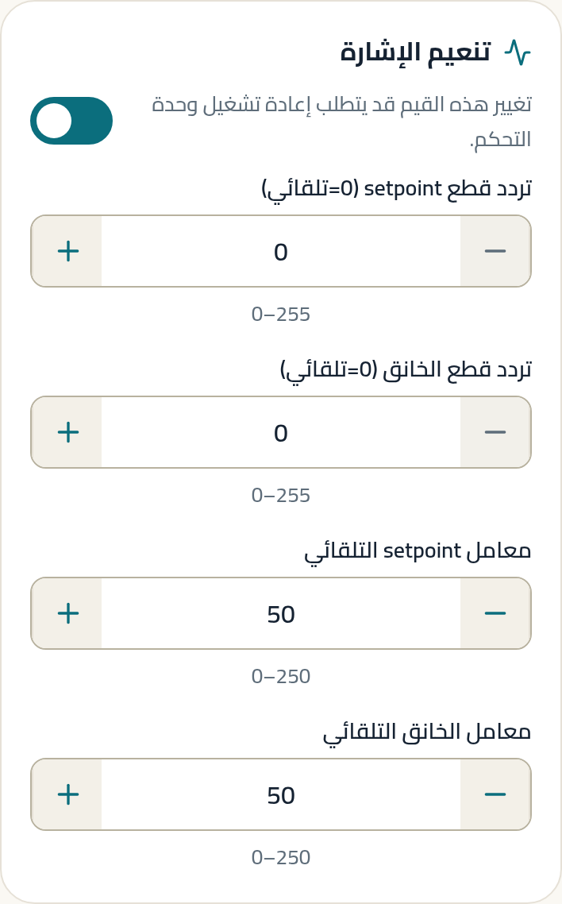
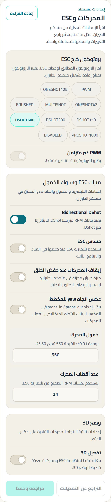
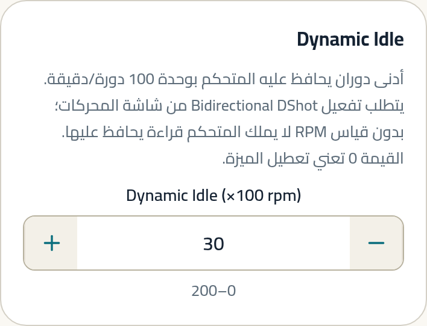

# الطيران الحر

حركات وقلبات وتدفّق حول العوائق. الهدف طائرة تفعل ما تطلبه فورًا،
وتبقى قابلة للتوقع عند الأطراف.

---

## لمن هذا الدليل

لمن يطير حول الهياكل والأشجار والمساحات المفتوحة، ويريد استجابة حادة
بلا عصبية. النمط الأوسع انتشارًا، ونقطة البداية المعقولة لمعظم الناس.

**المنصات المعتادة:** 5" (الأشهر) · 3–4" للمساحات الضيقة ·
7" للطيران الواسع.

---

## الحقيقة أولًا

> **حقيقة (Betaflight).** الإعداد الرسمي «Generic 250Hz Freestyle»
> يعرّف النمط بثلاثة حقول فقط — تجاهل الارتجاف **8**، وتنعيم
> **2_POINT**، ومعاملَي تنعيم **50/50** — **ولا يلمس P أو I أو D
> إطلاقًا** (S1.3). ومدى ما تستعمله المكتبة الرسمية في هذين الحقلين
> عبر أنماطها كلها هو 3–16 للارتجاف و25–180 لمعامل التنعيم
> (S1.1–S1.4)، فقيم هذا الضبط تقع **داخل** ذلك المدى لا خارجه، وكلها
> أرقام رسمية لا متوسطات حسبناها نحن.

> **توصيتنا.** إن لم تكن متأكدًا من نمطك، ابدأ هنا. هذا ضبط رسمي
> قائم بذاته، لا حلٌّ وسط اضطراري — وكل رقم فيه مأخوذ من الإعداد
> الرسمي كما هو.

---

## نقطة البداية الموصى بها

هذه **نقطة بداية**، لا ضبط نهائي.

### إلزامي

| اضبط | ابدأ بـ | لماذا | غيّرها إذا |
|---|---|---|---|
| تجاهل ارتجاف العصا | **8** `[A]` (S1.3) | يزيل الارتعاش دون أن يبتلع الحركات الدقيقة | تريد حدّة أكبر → 5 (S1.10b, رابط ELRS) |
| تنعيم Feedforward | **نقطتان (2_POINT)** `[A]` (S1.3) | استجابة نظيفة مع رابط 250Hz فأعلى | رابطك 150Hz أو أقل → بلا تنعيم (S1.10b) |
| معامل setpoint التلقائي | **50** `[A]` (S1.3) | المدى الرسمي عبر الأنماط 25–180؛ و50 قريبة من طرفه السريع: تنعيم يكفي دون أن يؤخّر الاستجابة | — |
| معامل الخانق التلقائي | **50** `[A]` (S1.3) | — | — |
| إجراء Failsafe | **قطع (DROP)** `[C]` | تطير في مدى بصرك؛ طائرة تهبط وحدها قد تطير بعيدًا | لديك GPS وتطير بعيدًا → GPS Rescue |

### موصى به

| اضبط | ابدأ بـ | لماذا | غيّرها إذا |
|---|---|---|---|
| إنذار RSSI dBm | **−98** `[A]` (S1.3) | ينذرك قبل أن يصبح الرابط مشكلة، لا بعدها | — |
| Bidirectional DShot | **مفعّل** `[A]` (S1.10b) | شرط فلتر RPM؛ محركات أبرد وفيديو أنظف | لا يدعمه ESC |
| عدد أقطاب المحرك | حسب محركك `[C]` | رقم خاطئ = فلتر على تردد غير موجود | — |
| Dynamic Idle | **30** (×100 rpm) `[A]` (S1.10a–c) | يمنع توقف المروحة في الهبوط الحاد وبعد القلبات | 3" أصغر أو محرك عالي kv → جرّب أعلى قليلًا |

### اختياري

| اضبط | ابدأ بـ | لماذا | غيّرها إذا |
|---|---|---|---|
| دفعة الاستجابة (Boost) | **اتركها 15** `[A]` (S1.13) | الأصل الرسمي للروابط هو 15، وإعداد الحر لا يغيّره | رابطك ELRS 250Hz فأعلى → 18 (S1.10b) |
| سقف الفلتر الديناميكي | **400 Hz** `[A]` (S1.10a–b) | مناسب لمدى دوران مراوح 3–5" | 7" → 300–400 (S1.10c) |
| أدنى الفلتر الديناميكي | **90 Hz** `[A]` (S1.10a–b) | — | 7" → 40 Hz (S1.10c) |
| `thrust_linear` | **30** لمقاس 5" `[B]` (S1.10b) | يصحّح لاخطية الدفع عند الخانق المنخفض | 3–4" → 40 · 7" → 10 · **لا يعرضه التطبيق حاليًا** |

> **قبل أن تبحث عن حقول الفلتر الديناميكي:** لا يسمح التطبيق بتعديلها إلا
> إذا أثبتت القراءة أن الميزة **نشطة بالفعل** على لوحتك، ولا يسمح بتفعيلها
> أو تعطيلها. هذا مقصود: إرسال قيم تفعيل إلى بناء لم تُثبت قراءته دعمه
> تخمين على متحكم طيران. إن لم تظهر الحقول، فالميزة غير نشطة في بنائك.

### تفضيل شخصي

- **Rates.** المكتبة الرسمية تعرض ثلاثة خيارات صريحة لنفس النمط (S1.10b)،
  وهذا في ذاته الجواب: لا يوجد رقم صحيح واحد. `[C]`

  | الخيار | RC rate | Expo | Super rate |
  |---|---|---|---|
  | منتصف ناعم · سرعة متوسطة | 2 | 40 | 80 (yaw 60) |
  | منتصف ناعم · سرعة عالية | 3 | 35 | 105 (yaw 90) |
  | منتصف متوسط · سرعة عالية | 25 | 45 | 108 (yaw 88) |

  ابدأ من الأول وارفع تدريجيًا. الأرقام أعلاه من الإعداد الرسمي
  حرفيًا، لكن **أيّها يناسبك تفضيل لا توصية**.

- **زاوية الكاميرا.** ترتفع مع سرعتك. `[C]`
- **Airmode.** يُبقي التحكم عند الخانق الصفري — معتاد في الحر. `[C]`

---

## الفرق حسب المنصة

| المنصة | ما يتغيّر | المصدر |
|---|---|---|
| 3–4" | `thrust_linear = 40` · أدنى فلتر 90 · سقف 400 | S1.10a |
| 5" | `thrust_linear = 30` · أدنى فلتر 90 · سقف 400 | S1.10b |
| 7" | `thrust_linear = 10` · **أدنى فلتر 40** · سقف 300–400 | S1.10c |

**لماذا 40 Hz لمقاس 7"؟** الهيكل الأطول يرنّ عند تردد أخفض، فيجب أن
يبدأ بحث الفلتر من تحت. هذا مثال على إعداد يتبع الهيكل لا النمط.

---

<!-- STEPS:BEGIN generated by _tools/write-steps.mjs -->

## خطوات الضبط — بالترتيب

اتبعها من الأولى إلى الأخيرة. كل خطوة تُظهر الشاشة نفسها بالقيم
الموصى بها في هذا الدليل، لا بقيم نمط آخر.

### الخطوة 1 — المستقبل

**أين:** المستقبل · بطاقة تنعيم الإشارة

**الموصى به:** `50` · `50`  ·  المصدر: S1.3

### الخطوة 2 — إحساس العصا

**أين:** ضبط PID · بطاقة إحساس العصا

**الموصى به:** `8` · `15` · 1 خيار محدَّد  ·  المصدر: S1.3، S1.13

### الخطوة 3 — المحركات

**أين:** المحركات · إعدادات ESC

**الموصى به:** 1 خيار محدَّد · 1 مفتاح مفعّل  ·  المصدر: S1.10b

### الخطوة 4 — Dynamic Idle

**أين:** ضبط PID · بطاقة Dynamic Idle

**الموصى به:** `30`  ·  المصدر: S1.10a–c

### الخطوة 5 — Failsafe

**أين:** Failsafe · إجراء المرحلة 2

**الموصى به:** 1 خيار محدَّد

### الخطوة 6 — OSD

**أين:** OSD · بطاقة التنبيهات

**الموصى به:** `-98 dBm`  ·  المصدر: S1.3

> كل صورة أعلاه مأخوذة من بناء التطبيق الحالي، ومفحوصة آليًا على
> **حالة عنصر التحكم نفسه** — القيمة داخل الحقل، والخيار المحدَّد،
> والمفتاح المفعّل — لا على مجرد ظهور النص في الصورة.

---

## بقية الإعدادات — قرار لكل واحد

كل ما لا تغيّره الخطوات أعلاه له قرار مكتوب هنا، حتى لا تبقى
تتساءل هل نسيناه. القرارات تخص **هذا النمط وحده**.

| الإعداد | القرار | التفاصيل | المصدر |
|---|---|---|---|
| ترددا القطع (setpoint · الخانق) | **اتركه كما هو** | اتركهما 0 — أي «تلقائي». إعداد الحر الرسمي يضبط المعاملين التلقائيين فقط. | S1.13 |
| Rates | **تفضيل الطيار** | المكتبة الرسمية تعرض ثلاثة ملفات للنمط نفسه، وهذا في ذاته الجواب: لا يوجد رقم صحيح واحد. الخيارات الرسمية — RC rate 2 / expo 40 / super 80 · أو 3 / 35 / 105 · أو 25 / 45 / 108. ابدأ من الأول وارفع تدريجيًا. | S1.10b |
| قيم PID (P · I · D) | **اتركه كما هو** | إعداد الحر الرسمي للرابط لا يلمس P أو I أو D. حزم الضبط تستعمل منزلقات simplified التي لا يعرضها التطبيق؛ لا تعدّل القيم يدويًا لملاحقتها. | S1.3 |
| الفلاتر (Gyro LPF · D-term LPF · Dynamic Notch) | **اتركه كما هو** | اتبع ضبط مقاسك. القيم المرجعية (سقف 400Hz وأدنى 90Hz لمقاس 3–5") في قسم «اختياري». | S1.10b |
| الأوضاع (Modes) | **تفضيل الطيار** | مفتاح ARM إلزامي. Airmode و Turtle و Beeper تفضيلك. | — |
| الطاقة والبطارية | **تفضيل الطيار** | اضبطها على حزمتك: عدد الخلايا وتحذير الخلية والسعة. لا قيمة «حرة» رسمية. | — |
| مرسل الفيديو (VTX) | **لا ينطبق** | لا يغيّره هذا النمط. اضبطه مرة واحدة حسب مكانك. | — |
| `thrust_linear` | **لا ينطبق** | 30 لمقاس 5" · 40 لمقاس 3–4" · 10 لمقاس 7" في الإعداد الرسمي، ولا يعرضه هذا التطبيق. | S1.10b |

<!-- STEPS:END -->

---

## تحذيرات

> **جلسة المحركات تدير المحركات فعلًا.** المراوح مفكوكة، دائمًا،
> بلا استثناء.

> **فلتر RPM يتطلب DShot ثنائي الاتجاه يعمل بشكل صحيح.** الإعدادات
> الرسمية تحمل تحذيرًا صريحًا: تشغيل ضبط يعتمد على فلتر RPM بدون
> فلترة RPM سليمة **قد يؤدي إلى حريق** (S1.8, S1.9). تحقق من أن قراءة
> RPM تصل قبل أن تطير.

> **بعد أي تغيير في الضبط: سلّح على الأرض واستمع.** يجب أن يكون الصوت
> نظيفًا بلا طحن. ثم حوّم وتحقق من حرارة المحركات. إن كان أي شيء
> غريبًا، لا تطر (S1.8, S1.9).

> **أوقف «Hardware ADC Filter» في راديو EdgeTX/OpenTX.** كل إعداد رابط
> رسمي يكرر هذا التحذير (S1.1–S1.7).

---

## ما لا يستطيع التطبيق ضبطه لهذا النمط

| الإعداد | الحالة |
|---|---|
| `thrust_linear` | `NOT SUPPORTED` — اختياري |
| معاملات فلتر RPM التفصيلية | `NOT SUPPORTED` — الشرطان الأساسيان مدعومان |
| منزلقات `simplified_*` | مستبعدة بقرار تصميمي |

---

## المصادر

الأرقام الأساسية من S1.3 (Generic 250Hz Freestyle، حالة `OFFICIAL`،
المؤلف Ivan Efimov) و S1.10a–c (SupaflyFPV Freestyle 3/4" · 5" · 7"،
حالة `OFFICIAL`).

**حالة التحقق:** `SOFTWARE / REFERENCE VERIFIED`.
لم تُختبر أي من هذه القيم في رحلة ضمن هذا العمل.
