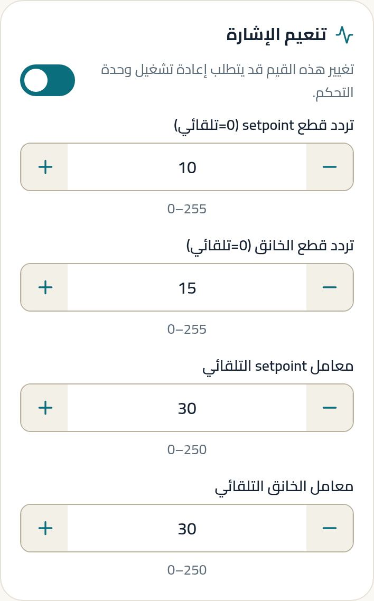
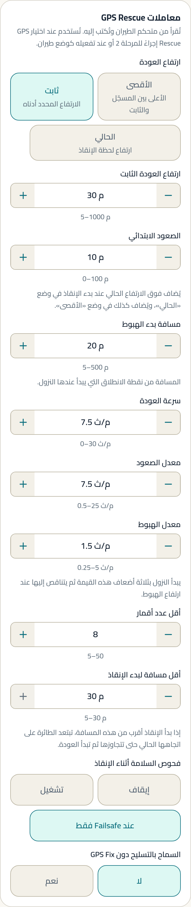
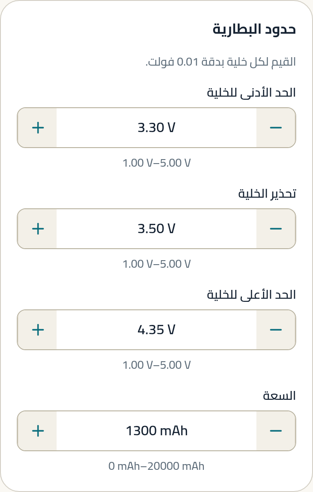
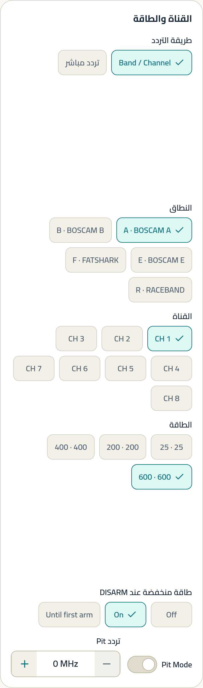
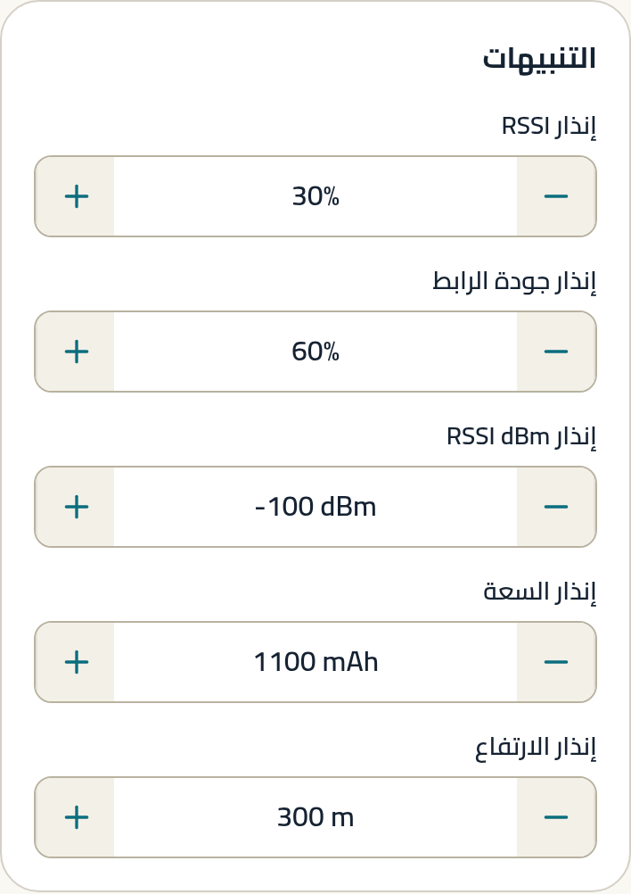
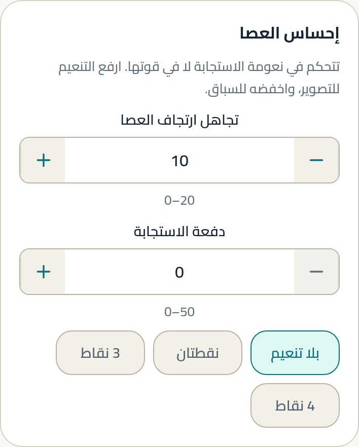

# المدى الطويل

الطيران خارج مدى البصر. النمط الوحيد الذي يكون فيه فقد الإشارة
حدثًا **متوقعًا** لا حادثًا — ولذلك يُخطَّط له مسبقًا.

---

## لمن هذا الدليل

لمن يطير مسافات، ويحتاج طائرة تعود وحدها. هذا الدليل أطول من غيره
عمدًا: بقية الأنماط تفشل بسقوط أمامك، وهذا يفشل بطائرة تختفي.

**المنصات المعتادة:** 7" (المعيار) · 6" · 5" خفيفة بمراوح كبيرة.

---

## الحقيقة أولًا

> **حقيقة (Betaflight).** `feature GPS` **مطفأ** في الأصل الرسمي،
> و`gps_rescue_allow_arming_without_fix` مضبوط على `OFF` (S1.12d).
> أي أن Betaflight نفسها تعتبر GPS قرارًا صريحًا، والتسليح بلا نقطة
> عودة خطأً افتراضيًا.

> **حقيقة (Betaflight).** الإعداد الرسمي للمدى الطويل (IRC Ghost 15Hz)
> يحمل تحذيرًا صريحًا: **«هذا وضع بطيء جدًا، ليس للسباق ولا للطيران
> الحر العادي»** (S1.5).

> **توصيتنا.** لا تجعل المدى الطويل ترقيةً لضبطك الحالي. هو ضبط مختلف
> بأولوية مختلفة: العودة أهم من الاستجابة.

---

## سلسلة السلامة — كلها أو لا شيء

المدى الطويل ليس إعدادًا واحدًا بل سلسلة. **حلقة واحدة مفقودة تعني
أن البقية لا تعمل.**

| # | الحلقة | تُضبط في | الحالة في التطبيق |
|---|---|---|---|
| 1 | منفذ GPS و UART المستقبل | المنافذ | `SUPPORTED` |
| 2 | بروتوكول المستقبل | المستقبل | `SUPPORTED` |
| 3 | تفعيل GPS والمزوّد | GPS | `SUPPORTED` |
| 4 | عدد الأقمار ودقة الموقع قبل الإقلاع | GPS (قراءة حيّة) | `SUPPORTED READ-ONLY` |
| 5 | تثبيت Home | GPS | `SUPPORTED` |
| 6 | `failsafe_procedure = GPS-RESCUE` | Failsafe | `SUPPORTED` |
| 7 | معاملات GPS Rescue الإحدى عشرة | Failsafe | `SUPPORTED` |
| 8 | GPS Rescue على مفتاح | الأوضاع | `SUPPORTED` |
| 9 | سعة البطارية وتحذير الخلية | الطاقة والبطارية | `SUPPORTED` |
| 10 | إنذار RSSI dBm في OSD | OSD | `SUPPORTED` |
| 11 | طاقة مرسل الفيديو | مرسل الفيديو | `SUPPORTED` |

**كل حلقة في سلسلة السلامة قابلة للضبط من هذا التطبيق.**

**ما هو غير متاح، وبصراحة:** قراءة **جودة الرابط (LQ)** و**RSSI بوحدة
dBm حيًّا**. لا يوجدان في عقد MSP إطلاقًا (`_meta/gaps.md` § G-4)،
فلا يستطيع أي تطبيق MSP عرضهما. تراهما في **نظارتك** عبر OSD.
التطبيق يضبط عتبة إنذارهما، ولا يخترع قراءة بديلة.

---

## نقطة البداية الموصى بها

القيم أدناه هي **أصول Betaflight الرسمية** من ملف إعادة ضبط GPS
الرسمي (S1.12d) — أي ما يعتبره المشروع نقطة بداية سليمة.

> **الوحدات هنا هي وحدات الشاشة، لا وحدات ملف الإعداد.** يخزّن المتحكم
> السرعات بالسنتيمتر/ثانية (750 · 750 · 150)، ويعرضها التطبيق بالمتر/ثانية
> (7.5 · 7.5 · 1.5) كما تفعل واجهة Betaflight نفسها. اكتب ما تراه على
> الشاشة، لا الرقم الخام من ملف الإعداد.

### إلزامي — لا تطر بدونها

| اضبط | ابدأ بـ | لماذا | غيّرها إذا |
|---|---|---|---|
| إجراء Failsafe | **GPS-RESCUE** `[A]` (S1.12d) | بدونه كل ما تحته بلا معنى | لا يوجد GPS → هذا ليس مدى طويلًا |
| أقل عدد أقمار | **8** `[A]` (S1.12d) | إنقاذ بأقمار قليلة يطير في اتجاه خاطئ | لا تخفضه. رفعه أأمن |
| ارتفاع العودة | **30 م** `[A]` (S1.12d) | يجب أن يعلو كل شجرة أو مبنى بينك وبين الطائرة | تطير فوق غابة أو تلال → ارفعه |
| السماح بالتسليح دون GPS Fix | **مطفأ** `[A]` (S1.12d) | التسليح بلا Fix يعني طائرة بلا نقطة عودة | **لا تشغّله** |
| فحوص السلامة | **`RESCUE_SANITY_FS_ONLY`** `[A]` (S1.12d) | يقطع الإنقاذ إذا تصرّف بشكل غير منطقي | — |
| استخدام البوصلة | **مفعّل** `[A]` (S1.12d) | بوصلة صحيحة = اتجاه عودة صحيح | لا بوصلة في اللوحة → أطفئه (S1.12d) |

### موصى به

| اضبط | ابدأ بـ | لماذا | غيّرها إذا |
|---|---|---|---|
| سرعة العودة | **7.5 م/ث** `[A]` (S1.12d) | أسرع = بطارية أقل وسيطرة أقل في الريح | ريح قوية → ارفعها قليلًا لتتقدم فعلًا |
| مسافة بدء الهبوط | **20 م** `[A]` (S1.12d) | متى يبدأ الهبوط قبل نقطة الانطلاق | — |
| أقل مسافة لبدء الإنقاذ | **30 م** `[A]` (S1.12d) | تحت هذه المسافة لا يبدأ الإنقاذ أصلًا | — |
| الصعود الابتدائي | **10 م** `[A]` (S1.12d) | صعود فوري قبل بدء العودة | — |
| معدل الصعود | **7.5 م/ث** `[A]` (S1.12d) | — | — |
| معدل الهبوط | **1.5 م/ث** `[A]` (S1.12d) | — | — |
| إنذار RSSI dBm | **اخفضه عن قيمة الحر (−98)** `[C]` | لا يضبط أي إعداد رسمي للمدى الطويل هذا الحقل. أبعد نقطة إنذار في المكتبة كلها هي −102 (S1.1, S1.2) وهي للسينمائي لا للمدى الطويل، فاستعمالها هنا **استنتاج منّا لا قيمة رسمية** | حساسية مستقبلك ونوع رابطك يحددان الرقم → عدّله بعد رحلة اختبار قصيرة داخل مدى بصرك |
| تحذير خلية البطارية | اضبطه على العودة لا على النفاد `[C]` | يجب أن تكفي البطارية للعودة، لا للطيران فقط | — |

### اختياري

| اضبط | ابدأ بـ | لماذا | غيّرها إذا |
|---|---|---|---|
| تنعيم Feedforward | **بلا تنعيم (OFF)** `[A]` (S1.5) | اختيار الإعداد الرسمي لرابط 15Hz | رابطك 150Hz فأعلى → استعمل قيم الحر |
| تجاهل ارتجاف العصا | **10** `[A]` (S1.5) | يناسب رابطًا بطيئًا | — |
| دفعة الاستجابة | **0** `[A]` (S1.5) | الإعداد الرسمي يصفّرها صراحةً لرابط بطيء | — |
| تردد قطع setpoint · تردد قطع الخانق | **10 Hz** · **15 Hz** `[A]` (S1.5) | قيم ثابتة بدل التلقائي، لأن الرابط البطيء يربك الحساب التلقائي | — |
| أدنى الفلتر الديناميكي | **40 Hz** لمقاس 7" `[A]` (S1.10c) | الهيكل الطويل يرنّ عند تردد أخفض | — |
| Dynamic Idle | **30** (×100 rpm) `[A]` (S1.10c) | — | — |

> **قبل أن تبحث عن حقول الفلتر الديناميكي:** لا يسمح التطبيق بتعديلها إلا
> إذا أثبتت القراءة أن الميزة **نشطة بالفعل** على لوحتك، ولا يسمح بتفعيلها
> أو تعطيلها. هذا مقصود: إرسال قيم تفعيل إلى بناء لم تُثبت قراءته دعمه
> تخمين على متحكم طيران. إن لم تظهر الحقول، فالميزة غير نشطة في بنائك.

### تفضيل شخصي

- **Rates.** المدى الطويل يميل إلى rates منخفضة: أنت تطير في خط مستقيم
  طويلًا لا تنعطف بحدة. `[C]`
- **زاوية الكاميرا.** منخفضة إلى متوسطة. `[C]`
- **طاقة مرسل الفيديو.** أعلى طاقة تسمح بها القوانين حيث تطير. `[C]`

---

## قبل كل رحلة — قائمة قصيرة

1. **الأقمار.** انتظر حتى يستقر العدد فوق حدّك الأدنى، لا حتى يبلغه.
2. **دقة الموقع.** التطبيق يصنّفها بنطاقات Betaflight نفسها. لا تقلع
   على تصنيف ضعيف.
3. **Home مثبَّت.** تحقق من ظهور اتجاه Home ومسافته.
4. **البوصلة.** إن كانت مفعّلة، تحقق من أن الاتجاه معقول قبل الإقلاع.
5. **البطارية.** احسب رحلة العودة، لا رحلة الذهاب.
6. **جرّب الإنقاذ قريبًا أولًا** — على ارتفاع آمن وفي مساحة مفتوحة،
   وأنت ما زلت ترى الطائرة.

---

<!-- STEPS:BEGIN generated by _tools/write-steps.mjs -->

## خطوات الضبط — بالترتيب

اتبعها من الأولى إلى الأخيرة. كل خطوة تُظهر الشاشة نفسها بالقيم
الموصى بها في هذا الدليل، لا بقيم نمط آخر.

### الخطوة 1 — المنافذ

**أين:** المنافذ · منفذ GPS

### الخطوة 2 — المستقبل

**أين:** المستقبل · المصدر و RSSI

**الموصى به:** `10` · `15`  ·  المصدر: S1.5

### الخطوة 3 — GPS

**أين:** GPS · التفعيل و Home والدقة

### الخطوة 4 — GPS Rescue

**أين:** Failsafe · معاملات GPS Rescue

**الموصى به:** `30 م` · `7.5 م/ث` · `1.5 م/ث` · `8` · 2 خيار محدَّد  ·  المصدر: S1.12d

### الخطوة 5 — الأوضاع

**أين:** الأوضاع · GPS Rescue على مفتاح

### الخطوة 6 — الطاقة والبطارية

**أين:** الطاقة · مثال 6S

**الموصى به:** `3.50 V`

### الخطوة 7 — مرسل الفيديو — الطاقة ومستوياتها الحقيقية

**أين:** مرسل الفيديو · القناة والطاقة

**الموصى به:** 2 خيار محدَّد

**لا رقم رسمي هنا، والقانون هو من يقرر.** ما تعرضه اللقطة هو **أعلى مستوى يعلنه هذا المرسل** (600) — لتعرف أين تقرأ المستويات المتاحة على عتادك، لا لتنسخ الرقم. القاعدة الوحيدة في هذا الدليل: أعلى طاقة **تسمح بها قوانين مكانك**، لا أعلى طاقة موجودة.

ومفعَّل هنا أيضًا **طاقة منخفضة عند DISARM**: المدى الطويل يعني وقتًا طويلًا مسلَّحًا وطاقة عالية، فخفض الطاقة تلقائيًا بعد نزع التسليح يقلّل حرارة المرسل وأنت واقف. `[C]`

### الخطوة 8 — OSD

**أين:** OSD · إنذارات السلامة

**الموصى به:** `-100 dBm` · `60%`

### الخطوة 9 — إحساس العصا

**أين:** ضبط PID · بطاقة إحساس العصا

**الموصى به:** `10` · `0` · 1 خيار محدَّد  ·  المصدر: S1.5

> كل صورة أعلاه مأخوذة من بناء التطبيق الحالي، ومفحوصة آليًا على
> **حالة عنصر التحكم نفسه** — القيمة داخل الحقل، والخيار المحدَّد،
> والمفتاح المفعّل — لا على مجرد ظهور النص في الصورة.

---

## بقية الإعدادات — قرار لكل واحد

كل ما لا تغيّره الخطوات أعلاه له قرار مكتوب هنا، حتى لا تبقى
تتساءل هل نسيناه. القرارات تخص **هذا النمط وحده**.

| الإعداد | القرار | التفاصيل | المصدر |
|---|---|---|---|
| المحركات و Dynamic Idle | **إجراء — بلا صورة** | فعّل Bidirectional DShot، واضبط عدد الأقطاب على محركك، واضبط Dynamic Idle على **30** (×100 rpm) لمقاس 7". من شاشة المحركات وشاشة ضبط PID. | S1.10c |
| Rates | **تفضيل الطيار** | لا توجد Rates رسمية للمدى الطويل. المبدأ: أبطأ من ملفك المعتاد — أنت تطير في خط مستقيم طويلًا لا تنعطف بحدة. والرقم اختيارك. | — |
| قيم PID (P · I · D) | **اتركه كما هو** | إعداد المدى الطويل الرسمي يغيّر إحساس العصا والتنعيم فقط، ولا يلمس P أو I أو D. | S1.5 |
| الفلاتر | **اتركه كما هو** | اتبع ضبط مقاسك. القيمة المرجعية لمقاس 7" هي أدنى فلتر ديناميكي 40Hz، لأن الهيكل الطويل يرنّ عند تردد أخفض. | S1.10c |
| قراءة جودة الرابط (LQ) و RSSI بوحدة dBm | **لا ينطبق** | **غير موجودتين في عقد MSP إطلاقًا**، فلا يستطيع أي تطبيق MSP عرضهما حيًّا. تراهما في نظارتك عبر OSD؛ التطبيق يضبط عتبة الإنذار فقط (الخطوة 8). | — |
| نوع التثبيت (2D/3D) و HDOP/VDOP | **لا ينطبق** | بروتوكول الاتصال مع المتحكم يرسل **بت تثبيت واحدًا و PDOP وحده** — لا 2D/3D ولا HDOP/VDOP. التطبيق يعرض PDOP بالاسم الصحيح ولا يخترع بديلًا. اسم الأمر نفسه في `_meta/sources.md` § S2.2. | — |

<!-- STEPS:END -->

---

## تحذيرات

> **GPS Rescue ليس ضمانًا.** هو إجراء يعمل عندما تكون كل حلقات
> السلسلة صحيحة. حلقة واحدة خاطئة — بوصلة غير معايرة، أقمار قليلة،
> Home غير مثبَّت — تعني طائرة تطير بثقة في الاتجاه الخطأ.

> **اختبر الإنقاذ وأنت ترى الطائرة.** أول تجربة لإجراء العودة يجب أن
> تكون على ارتفاع آمن، في مساحة مفتوحة، ضمن مدى بصرك. لا تجعل أول
> تجربة هي الحالة الحقيقية.

> **البطارية تُحسب للعودة.** طائرة تنقطع في أبعد نقطة ببطارية كافية
> للذهاب فقط لن تصل.

> **لا تشغّل مرسل الفيديو بلا هوائي.** قد يتلف خلال ثوانٍ. وهذا أخطر
> في المدى الطويل لأنك ترفع الطاقة.

> **`السماح بالتسليح دون GPS Fix` مطفأ لسبب.** تشغيله يعني تسليحًا
> بلا نقطة عودة معروفة.

> **الرابط البطيء ليس للطيران الحر.** الإعداد الرسمي يحذّر من هذا
> نصًّا (S1.5). لا تطر أكروبات على وضع 15Hz.

---

## ما لا يستطيع التطبيق ضبطه لهذا النمط

| العنصر | الحالة | الأثر |
|---|---|---|
| قراءة LQ حيًّا | `NOT AVAILABLE FROM MSP` | تراها في نظارتك؛ التطبيق يضبط عتبة الإنذار |
| قراءة RSSI dBm حيًّا | `NOT AVAILABLE FROM MSP` | نفسه |
| نوع التثبيت (2D/3D) | `NOT AVAILABLE FROM MSP` | `MSP_RAW_GPS` يرسل بت تثبيت واحدًا فقط |
| HDOP / VDOP | `NOT AVAILABLE FROM MSP` | تُستعمل PDOP بدلًا منها، بالاسم الصحيح |
| معدل الرابط (15Hz / 150Hz) | `NOT AVAILABLE FROM MSP` | يُضبط في الراديو والمستقبل |

**لا شيء من هذه يمنع ضبط سلسلة السلامة.** كلها قراءات حيّة أو إعدادات
خارج متحكم الطيران، لا حلقات إعداد مفقودة.

---

## المصادر

- معاملات GPS Rescue: S1.12d (`presets/2025.12/other/reset_gps.txt`،
  حالة `OFFICIAL`، المؤلف Betaflight) — كل رقم في القسم الإلزامي
  والموصى به منها حرفيًا.
- إعداد الرابط البطيء: S1.5 (IRC Ghost Long Range، حالة `OFFICIAL`).
- قيم مقاس 7": S1.10c (SupaflyFPV Freestyle 7 Inch، حالة `OFFICIAL`).
- حدود كل معامل: S2.1 (`settings.c`).

**حالة التحقق:** `SOFTWARE / REFERENCE VERIFIED`.
لم يُختبر أي إجراء إنقاذ في رحلة ضمن هذا العمل، ولم تُنفَّذ أي بنود
`docs/HARDWARE_RELEASE_CHECKLIST.md` بعد.
