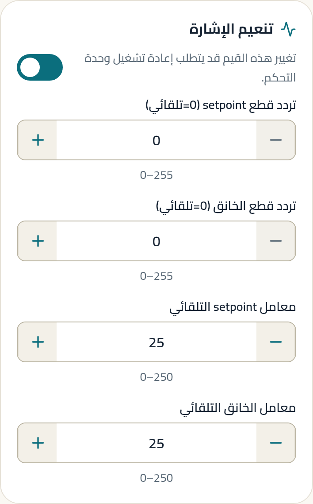
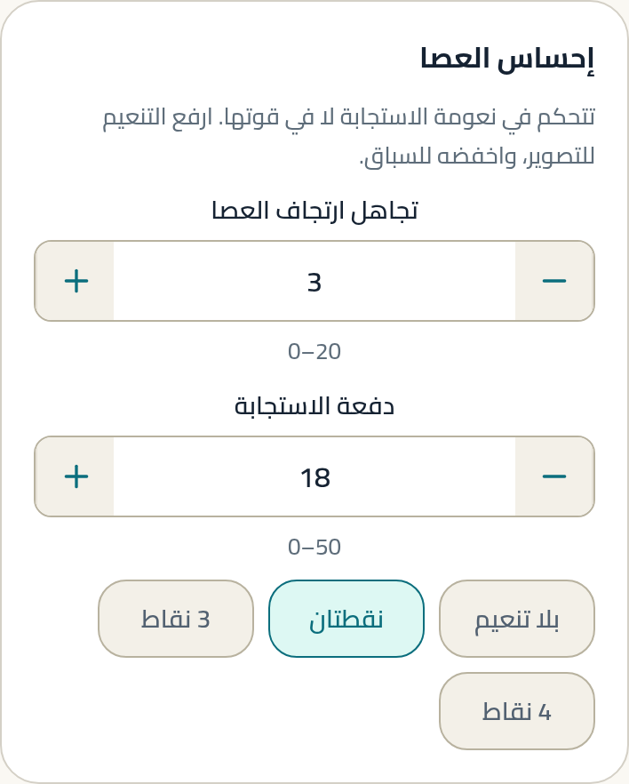
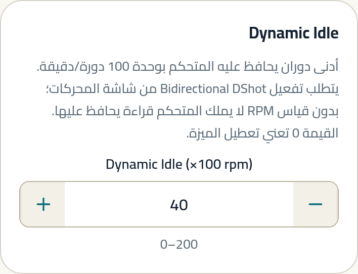
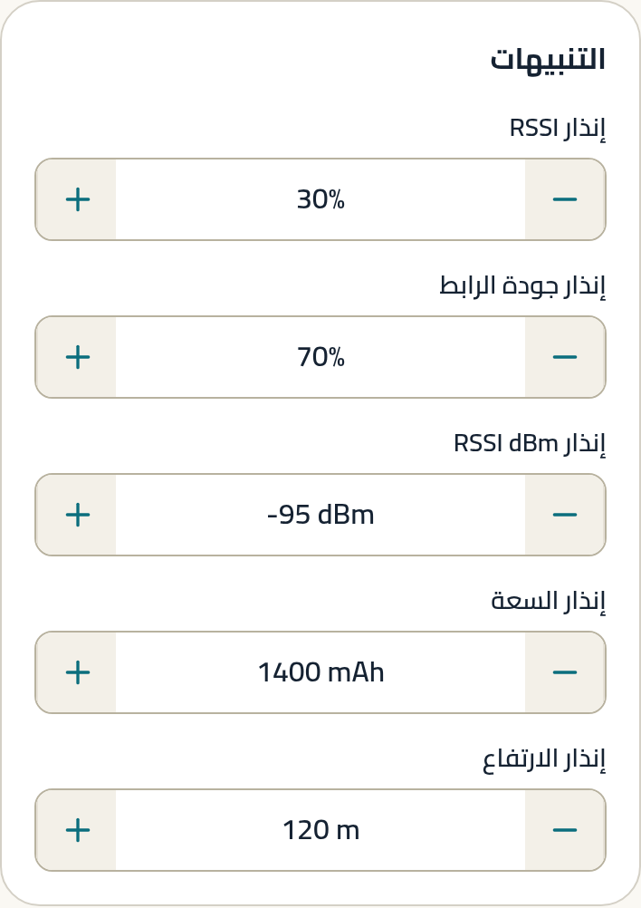
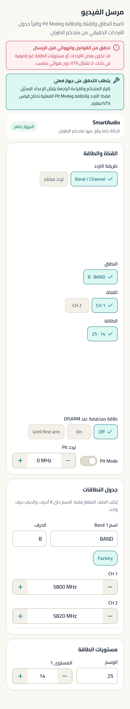

# السباق

أقصر زمن حول مسار. كل شيء يُقاس بالتأخير: من عصاك إلى المحرك، ومن
الكاميرا إلى عينك.

---

## لمن هذا الدليل

لمن يطير مسارات، أو يريد أحدّ استجابة ممكنة. النمط الأقل تسامحًا:
لا يخفي خطأ ضبط، ولا خطأ بناء.

**المنصات المعتادة:** 5" على 6S (المعيار) · وووب 1S للسباق الداخلي.

---

## الحقيقة أولًا

> **حقيقة (Betaflight).** الإعداد الرسمي «Generic 500Hz Race» هو
> الوحيد بين إعدادات الأنماط الأربعة الذي يضبط `feedforward_boost`
> صراحةً — عند 18 (S1.4).

> **توصيتنا.** لا تنسخ أرقام السباق إلى طائرة لا يمكنك الوثوق ببنائها.
> الضبط الحاد لا يصلح إطارًا مهترئًا، بل يكشفه. الإعداد الرسمي نفسه
> يقول هذا: يقدّم خيار «طائرة سيئة» بقيم أهدأ للأطر غير المخدومة (S1.9).

---

## نقطة البداية الموصى بها

هذه **نقطة بداية**، لا ضبط نهائي.

### إلزامي

| اضبط | ابدأ بـ | لماذا | غيّرها إذا |
|---|---|---|---|
| تجاهل ارتجاف العصا | **3** `[A]` (S1.4, S1.9) | أقل تجاهل ممكن = أحدّ إحساس | تشعر بعصبية → 7 (الإعداد الرسمي يسميه «الإحساس المعياري») |
| تنعيم Feedforward | **نقطتان (2_POINT)** `[A]` (S1.4) | — | — |
| دفعة الاستجابة (Boost) | **18** `[A]` (S1.4, S1.8) | تسارع فوري على العصا | تشعر بتجاوز عند التوقف → اخفضها |
| معامل setpoint التلقائي | **25** `[A]` (S1.4) | أقل تنعيم = أقل تأخير | رابطك أبطأ من 500Hz → ارفعه |
| معامل الخانق التلقائي | **25** `[A]` (S1.4) | الوحيد بين الأنماط الذي يخفض تنعيم الخانق أيضًا | — |
| إجراء Failsafe | **قطع (DROP)** `[C]` | مسار سباق فيه ناس؛ طائرة تهبط وحدها أخطر من ساقطة | — |

### موصى به

| اضبط | ابدأ بـ | لماذا | غيّرها إذا |
|---|---|---|---|
| إنذار RSSI dBm | **−95** `[A]` (S1.4) | أبكر إنذار بين الأنماط: أنت سريع وقريب، فالوقت للتصحيح قصير | — |
| Bidirectional DShot | **مفعّل** `[A]` (S1.9) | شرط فلتر RPM | لا يدعمه ESC |
| بروتوكول المحرك | **DSHOT600** `[A]` (S1.9) | أسرع إرسال أمر | ترى أخطاء في شاشة المحركات → **DShot300** (S1.9 يوصي بهذا صراحةً) |
| Dynamic Idle | **40** (×100 rpm) لـ 5" على 6S 2000kv `[A]` (S1.9) | يمنع توقف المروحة في الانعطافات الحادة | وووب → 120 (S1.8) |

### اختياري

| اضبط | ابدأ بـ | لماذا | غيّرها إذا |
|---|---|---|---|
| سقف الفلتر الديناميكي | **650 Hz** `[A]` (S1.9, S1.11d) | مراوح السباق تدور أسرع | — |
| أدنى الفلتر الديناميكي | **125 Hz** لبناء نظيف `[B]` (S1.11d) | 100 لبناء متوسط | تسمع طنينًا → اخفضه |
| `thrust_linear` | **20** `[A]` (S1.9) | — | **لا يعرضه التطبيق حاليًا** |

> **قبل أن تبحث عن حقول الفلتر الديناميكي:** لا يسمح التطبيق بتعديلها إلا
> إذا أثبتت القراءة أن الميزة **نشطة بالفعل** على لوحتك، ولا يسمح بتفعيلها
> أو تعطيلها. هذا مقصود: إرسال قيم تفعيل إلى بناء لم تُثبت قراءته دعمه
> تخمين على متحكم طيران. إن لم تظهر الحقول، فالميزة غير نشطة في بنائك.

### تفضيل شخصي

- **Rates.** لا يوجد رقم رسمي واحد للسباق. طيارو السباق يميلون إلى
  expo أقل من الحر لأن الدقة في المنتصف أهم من مدى الطرف. `[C]`
- **حدّ الخانق.** بعض المسارات المنظّمة تفرضه. `[C]`
- **زاوية الكاميرا.** مرتفعة (35–45°) للسرعة العالية. `[C]`

---

## الفرق حسب المنصة

| المنصة | ما يتغيّر | المصدر |
|---|---|---|
| 5" على 6S | DSHOT600 · Dynamic Idle 40 · سقف فلتر 650 · `tpa_rate = 70` | S1.9 |
| وووب 1S للسباق (15–18 غ) | **Dshot300** · `motor_poles = 12` · Dynamic Idle **120** · أقصى جهد خلية 4.45V | S1.8 |

**الوووب ليس سباقًا مصغّرًا.** الأرقام مختلفة جوهريًا: بروتوكول محرك
أبطأ، وأرضية دوران أعلى بثلاثة أضعاف. الإعداد الرسمي للوووب يوصي
أيضًا ببناء 48kHz لا 96kHz، ويقول إن 96kHz يقلل السيطرة بفارق كبير
(S1.8). للتفاصيل: دليل **الوووب والطيران الداخلي**.

---

<!-- STEPS:BEGIN generated by _tools/write-steps.mjs -->

## خطوات الضبط — بالترتيب

اتبعها من الأولى إلى الأخيرة. كل خطوة تُظهر الشاشة نفسها بالقيم
الموصى بها في هذا الدليل، لا بقيم نمط آخر.

### الخطوة 1 — المستقبل

**أين:** المستقبل · بطاقة تنعيم الإشارة

**الموصى به:** `25` · `25`  ·  المصدر: S1.4

### الخطوة 2 — إحساس العصا

**أين:** ضبط PID · بطاقة إحساس العصا

**الموصى به:** `3` · `18` · 1 خيار محدَّد  ·  المصدر: S1.4

### الخطوة 3 — المحركات

**أين:** المحركات · إعدادات ESC

**الموصى به:** 1 خيار محدَّد · 1 مفتاح مفعّل  ·  المصدر: S1.9

### الخطوة 4 — Dynamic Idle

**أين:** ضبط PID · بطاقة Dynamic Idle

**الموصى به:** `40`  ·  المصدر: S1.9

### الخطوة 5 — Failsafe

**أين:** Failsafe · إجراء المرحلة 2

**الموصى به:** 1 خيار محدَّد

### الخطوة 6 — OSD

**أين:** OSD · بطاقة التنبيهات

**الموصى به:** `-95 dBm`  ·  المصدر: S1.4

### الخطوة 7 — مرسل الفيديو

**أين:** مرسل الفيديو · القناة والطاقة

> كل صورة أعلاه مأخوذة من بناء التطبيق الحالي، ومفحوصة آليًا على
> **حالة عنصر التحكم نفسه** — القيمة داخل الحقل، والخيار المحدَّد،
> والمفتاح المفعّل — لا على مجرد ظهور النص في الصورة.

<!-- STEPS:END -->

---

## تحذيرات

> **لا تشغّل مرسل الفيديو بلا هوائي.** قد يتلف المرسل خلال ثوانٍ.

> **في السباق المنظّم، القناة والطاقة ليستا اختيارك وحدك.** تشغيل
> قناة غير مخصصة لك يفسد فيديو طيار آخر أثناء طيرانه.

> **فلترة RPM إلزامية مع ضبط السباق.** الإعدادات الرسمية تقول
> صراحةً إن تشغيل هذا الضبط بدون فلترة RPM **قد يؤدي إلى حريق**
> (S1.8, S1.9).

> **سلّح على الأرض واستمع قبل أن تطير.** صوت نظيف بلا طحن، ثم تحويم
> وفحص حرارة المحركات. إن كان أي شيء غريبًا، لا تطر (S1.9).

> **ضبط السباق يفترض إطارًا مخدومًا.** أذرع مرتخية أو محركات متضررة
> تحوّل الضبط الحاد إلى اهتزاز.

---

## ما لا يستطيع التطبيق ضبطه لهذا النمط

| الإعداد | الحالة |
|---|---|
| `thrust_linear` · `tpa_*` | `NOT SUPPORTED` |
| معاملات فلتر RPM التفصيلية | `NOT SUPPORTED` — الشرطان الأساسيان مدعومان |
| Launch Control · Transponder | مستبعدان بقرار (`_meta/gaps.md`) |
| منزلقات `simplified_*` | مستبعدة بقرار تصميمي |

---

## المصادر

الأرقام الأساسية من S1.4 (Generic 500Hz Race، حالة `OFFICIAL`،
المؤلف Ivan Efimov) و S1.9 (Karate Race 6s 5" 2025.12، حالة
`OFFICIAL`، المؤلف sugarK) و S1.11d (UAV Tech 5" Race، حالة
`OFFICIAL`).

**حالة التحقق:** `SOFTWARE / REFERENCE VERIFIED`.
لم تُختبر أي من هذه القيم في رحلة ضمن هذا العمل.
