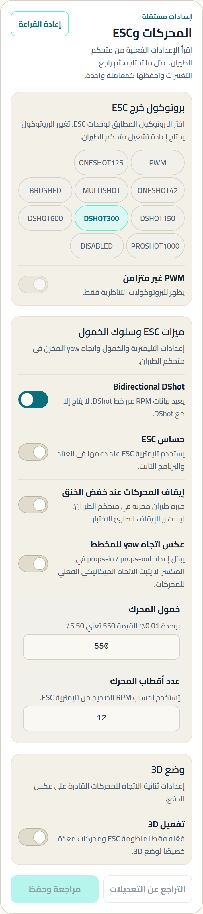
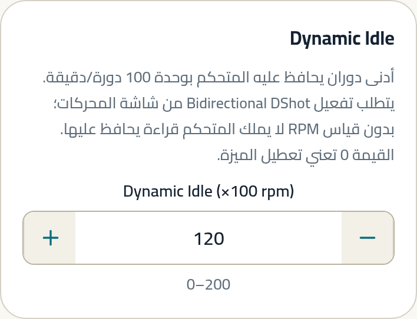
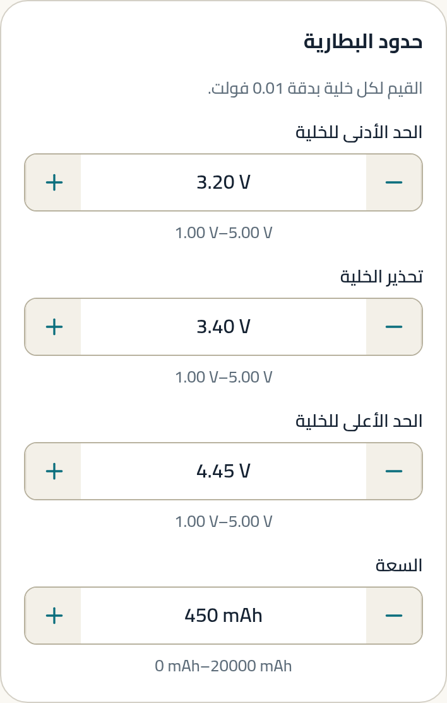
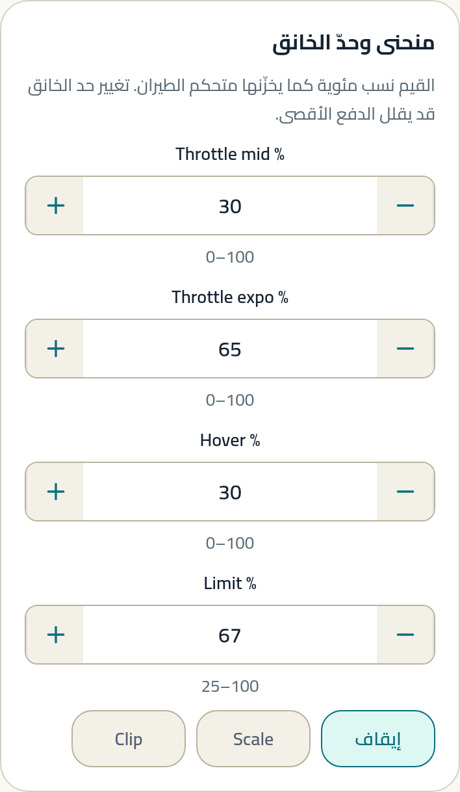
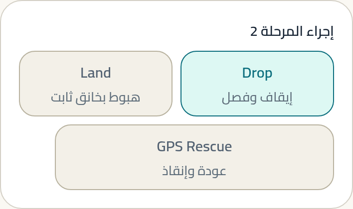

# الوووب والطيران الداخلي

طائرة صغيرة بمراوح محمية، تطير داخل الغرف وبين الأثاث. أصغر منصة،
وأكثرها اختلافًا عن كل ما سبق.

---

## لمن هذا الدليل

للطيران الداخلي، والمساحات الضيقة، والتدرّب بلا مخاطرة. أيضًا لمن
يريد أن يطير كثيرًا بأقل ضرر ممكن.

**المنصات المعتادة:** وووب 1S بقاعدة 65 مم (بلا فرش) · وووب 2S.

---

## الحقيقة أولًا

> **حقيقة (Betaflight).** الإعداد الرسمي للوووب لا يشبه إعداد 5"
> في القيم الأساسية: بروتوكول محرك أبطأ (`Dshot300`)، وأرضية دوران
> أعلى بثلاثة أضعاف (120–150 مقابل 30–40)، و`motor_poles = 12`،
> وأقصى جهد خلية 4.45V (S1.8).

> **توصيتنا.** لا تنسخ إعدادات 5" إلى وووب. الفارق ليس في الحجم فقط
> بل في فيزياء المروحة نفسها.

> **حقيقة (Betaflight).** الإعداد الرسمي مكتوب لوووب **بلا فرش**
> (brushless)، ويقول صراحةً إنه **لا يصلح لوووب بفرش** (S1.8).

---

## نقطة البداية الموصى بها

هذه **نقطة بداية**، لا ضبط نهائي.

### إلزامي

| اضبط | ابدأ بـ | لماذا | غيّرها إذا |
|---|---|---|---|
| بروتوكول المحرك | **Dshot300** `[A]` (S1.8) | الاختيار الرسمي للوووب. أسرع ليس أفضل هنا | — |
| عدد أقطاب المحرك | **12** `[A]` (S1.8) | رقم خاطئ = قراءة RPM خاطئة = فلتر على تردد غير موجود | محركك مختلف → استعمل رقمه |
| Bidirectional DShot | **مفعّل** `[A]` (S1.8) | شرط أرضية الدوران والفلترة | لا يدعمه ESC |
| Dynamic Idle | **120** (×100 rpm) لوووب سباق 15–18 غ `[A]` (S1.8) | يمنع توقف المروحة تمامًا في الهبوط | وووب أثقل من 18 غ → **150** (S1.8) |
| إجراء Failsafe | **قطع (DROP)** `[C]` | تطير داخل غرفة؛ السقوط من متر أرحم من طائرة تبحث عن مخرج | — |

### موصى به

| اضبط | ابدأ بـ | لماذا | غيّرها إذا |
|---|---|---|---|
| تجاهل ارتجاف العصا | **3** للإحساس السريع `[A]` (S1.8) | الخيار المعلَّم في الإعداد الرسمي | تريد إحساسًا معياريًا → **7** · أحدّ ما يمكن → **0** (S1.8) |
| دفعة الاستجابة (Boost) | **18** `[A]` (S1.8) | — | — |
| أقصى جهد خلية | **4.45V** `[A]` (S1.8) | خلايا 1S الحديثة تتجاوز 4.2V | بطاريتك 4.2V تقليدية → اتركه |
| تعويض هبوط الجهد (`vbat_sag_compensation`) | **مفعّل — لكن لا يمكن ضبطه من هذا التطبيق** `[A]` (S1.8) | خلية 1S تهبط بشدة تحت الحمل؛ التعويض يبقي الإحساس ثابتًا | يُضبط من سطر الأوامر أو بتطبيق الحزمة الرسمية |

### اختياري

| اضبط | ابدأ بـ | لماذا | غيّرها إذا |
|---|---|---|---|
| Airmode | **مطفأ** للطيران الداخلي `[A]` (S1.8) | الإعداد الرسمي يقول إن إطفاءه أفضل أداءً داخل الغرف | تطير أكروبات في مساحة كبيرة → ضعه على مفتاح (S1.8) |
| منحنى الخانق | mid **30** · hover **30** · expo **65** `[A]` (S1.8) | يوسّع دقة التحكم حول نقطة التحويم | تحويمك عند 45% → استعمل 45/45/65 (S1.8) |
| إنذار RSSI dBm | ابدأ من **−98** `[C]` | لا يوجد رقم رسمي للوووب؛ هذا رقم الحر كنقطة بداية | تطير في مبنى فيه جدران كثيرة → ارفعه |

### تفضيل شخصي

- **Rates.** لا يوجد رقم رسمي عام. الوووب يميل إلى rates أعلى في yaw
  لأن دورانه بطيء بطبعه. `[C]`
- **زاوية الكاميرا.** منخفضة جدًا (0–15°) للطيران البطيء الداخلي. `[C]`

---

## لماذا أرضية الدوران عالية إلى هذا الحد

المروحة الصغيرة تفقد دفعها بسرعة أكبر عند انخفاض الدوران، وتحتاج زمنًا
أطول نسبيًا لاستعادته. أرضية 120–150 (أي 12,000–15,000 دورة/دقيقة)
تُبقي المروحة في مدى فعّال دائمًا.

هذا أعلى بثلاثة إلى خمسة أضعاف من 5" — وهو أوضح مثال في هذا الدليل على
إعداد يتبع **المنصة** لا النمط.

---

<!-- STEPS:BEGIN generated by _tools/write-steps.mjs -->

## خطوات الضبط — بالترتيب

اتبعها من الأولى إلى الأخيرة. كل خطوة تُظهر الشاشة نفسها بالقيم
الموصى بها في هذا الدليل، لا بقيم نمط آخر.

### الخطوة 1 — المحركات

**أين:** المحركات · إعدادات ESC

**الموصى به:** `12` · 1 خيار محدَّد · 1 مفتاح مفعّل  ·  المصدر: S1.8

### الخطوة 2 — Dynamic Idle

**أين:** ضبط PID · بطاقة Dynamic Idle

**الموصى به:** `120`  ·  المصدر: S1.8

### الخطوة 3 — إحساس العصا

**أين:** ضبط PID · بطاقة إحساس العصا

**الموصى به:** `3` · `18`  ·  المصدر: S1.8

### الخطوة 4 — الطاقة والبطارية

**أين:** الطاقة · حدود بطارية 1S

**الموصى به:** `4.45 V` · `450 mAh`  ·  المصدر: S1.8

### الخطوة 5 — منحنى الخانق

**أين:** ضبط PID · منحنى وحدّ الخانق

**الموصى به:** `30` · `65` · `30`  ·  المصدر: S1.8

### الخطوة 6 — Failsafe

**أين:** Failsafe · إجراء المرحلة 2

**الموصى به:** 1 خيار محدَّد

> كل صورة أعلاه مأخوذة من بناء التطبيق الحالي، ومفحوصة آليًا على
> **حالة عنصر التحكم نفسه** — القيمة داخل الحقل، والخيار المحدَّد،
> والمفتاح المفعّل — لا على مجرد ظهور النص في الصورة.

<!-- STEPS:END -->

---

## تحذيرات

> **حجم الطائرة لا يجعل جلسة المحركات آمنة.** المحركات تدور فعلًا.
> المراوح مفكوكة، حتى على وووب.

> **فلترة RPM إلزامية مع هذا الضبط.** الإعداد الرسمي يقول حرفيًا إن
> تشغيله بدونها **قد يؤدي إلى حريق** (S1.8).

> **سلّح على الأرض واستمع.** صوت نظيف بلا طحن، ثم تحويم وفحص حرارة
> المحركات. إن كان أي شيء غريبًا، لا تطر (S1.8).

> **4.45V لخلايا 1S الحديثة فقط.** ضبط هذا الرقم على بطارية 4.2V
> تقليدية يعني أن تحذير الجهد لن يصل في وقته.

> **الطيران الداخلي يعني ناسًا وأشياء على مسافة أمتار.** جرّب أي
> إعداد جديد في أوسع مساحة متاحة أولًا.

---

## ما لا يستطيع التطبيق ضبطه لهذا النمط

| الإعداد | الحالة |
|---|---|
| `thrust_linear` | `NOT SUPPORTED` — اختياري |
| معاملات فلتر RPM التفصيلية | `NOT SUPPORTED` — الشرطان الأساسيان مدعومان |
| `vbat_sag_compensation` | `NOT SUPPORTED` — موصى به في الإعداد الرسمي، ويُضبط من سطر الأوامر أو بتطبيق الحزمة |
| `cpu_late_limit_permille` | `NOT SUPPORTED` — يضبطه الإعداد الرسمي عند 15، ولا يمنع غيابه الطيران |
| منزلقات `simplified_*` | مستبعدة بقرار تصميمي |

---

## المصادر

الأرقام الأساسية من S1.8 (Karate RACE Whoop 2025.12، حالة `OFFICIAL`،
المؤلف sugarK) — إعداد مكتوب لوووب بلا فرش في مدى أقل من 20 غرامًا.

قيم إحساس العصا التي لا رقم رسمي لها في هذا النمط مأخوذة من دليل
**الطيران الحر** كنقطة بداية، ومعلَّمة `[C]`.

**حالة التحقق:** `SOFTWARE / REFERENCE VERIFIED`.
لم تُختبر أي من هذه القيم في رحلة ضمن هذا العمل.
